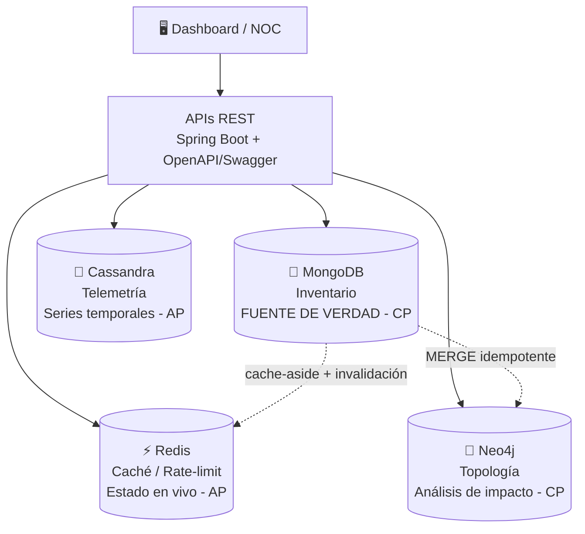

# Cuy Mobile 5GC — API de Inventario y Observabilidad

API REST para el inventario y monitoreo de una red núcleo 5G (5GC) del operador ficticio Cuy Mobile, distribuida en 14 sites del Perú.
Proyecto del curso Lenguajes de Programación (1INF13) — Maestría en Informática, PUCP.


---

## Arquitectura

El sistema usa una **arquitectura políglota de persistencia**: cada motor NoSQL resuelve una necesidad específica del negocio que un único motor relacional no podría atender eficientemente.



### ¿Por qué 4 motores?

| Necesidad | Patrón de acceso | Motor elegido |
|---|---|---|
| Inventario flexible de elementos de red | Documentos heterogéneos, consultas variadas | MongoDB |
| Telemetría continua (CPU, memoria, throughput) | Escritura masiva, rangos de tiempo | Cassandra |
| Análisis de impacto ante fallas | Recorridos de grafo multi-salto | Neo4j |
| Caché, rate-limiting, heartbeats | Latencia sub-milisegundo, TTL nativo | Redis |

---

## Modelo de datos

### MongoDB — Inventario (fuente de verdad)

| Colección | Contenido | Patrón de `_id` |
|---|---|---|
| `network_elements` | Servidores, switches, storage | `LIM-SRV-01`, `LIM-SW-01` |
| `network_functions` | AMF, SMF, UPF, NRF, AUSF, UDM, PCF, NSSF | `LIM-AMF-01`, `AQP-UPF-02` |
| `sites` | 14 sites en Perú organizados en 3 tiers | `LIM`, `AQP`, `TRU` |

Los 14 sites se organizan en:
- **Tier 1 - Core DC:** Lima y Arequipa (plano de control completo)
- **Tier 2 - Regional:** Trujillo, Piura, Cusco
- **Tier 3 - Edge:** Huaraz, Puno, Iquitos, Tacna y más

### Cassandra — Telemetría (series temporales)

Keyspace: `core5g_metrics`

| Tabla | Clave de partición | Uso |
|---|---|---|
| `metrics_by_element` | `(element_id, metric_name, bucket_date)` | Series temporales históricas |
| `latest_metrics` | `(element_id, metric_name)` | Último valor por KPI |

KPIs monitoreados: `cpu_pct`, `mem_pct`, `throughput_mbps`, `latency_ms`

### Neo4j — Topología y dependencias

```cypher
(:Server)-[:IN_RACK]->(:Rack)-[:AT_SITE]->(:Site)
(:Server)-[:CONNECTED_TO]->(:Switch)
(:NetworkFunction)-[:HOSTED_ON]->(:Server)
(:NetworkFunction)-[:USES_INTERFACE {iface:'N11'}]->(:NetworkFunction)
(:NetworkFunction)-[:REGISTERED_IN]->(:NetworkFunction)
```

### Redis — Caché y estado en vivo

| Clave | Tipo | Uso | TTL |
|---|---|---|---|
| `status:nf:{id}` | Hash | Heartbeat de cada NF | 60s |
| `cache:elements:{hash}` | String | Caché de listados | 30s |
| `ratelimit:{key}:{window}` | Counter | Rate limiting API | 60s |

---

## Endpoints

API disponible en `http://localhost:8080`

| Método | Endpoint | Descripción | Motor |
|---|---|---|---|
| `GET` | `/api/v1/elements` | Listar inventario completo de la red | MongoDB |
| `GET` | `/api/v1/elements/{id}/metrics?metric=cpu_pct` | KPIs de rendimiento de un elemento | Cassandra |
| `GET` | `/api/v1/topology/{id}/impact` | Análisis de impacto ante la caída de un nodo | Neo4j |

Documentación interactiva: `http://localhost:8080/swagger-ui/index.html`

---

## Ejecución local

```bash
# 1. Levantar los 4 motores NoSQL con Docker
cd app/
docker compose up -d

# 2. Cargar datos sintéticos (14 sites, 40 NFs, telemetría)
poetry run python seed/generate.py

# 3. Levantar la API Spring Boot
cd ../cuy-mobile-api/
mvn spring-boot:run

# 4. Abrir Swagger UI
open http://localhost:8080/swagger-ui/index.html
```

---

## Estructura del proyecto

```
cuy-mobile-api/
├── src/main/java/com/example/cuymobileapi/
│   ├── CuyMobileApiApplication.java
│   ├── MongoConfig.java
│   └── controller/
│       ├── ElementController.java    # MongoDB
│       ├── MetricsController.java    # Cassandra
│       └── TopologyController.java   # Neo4j
└── src/main/resources/
    └── application.properties
```